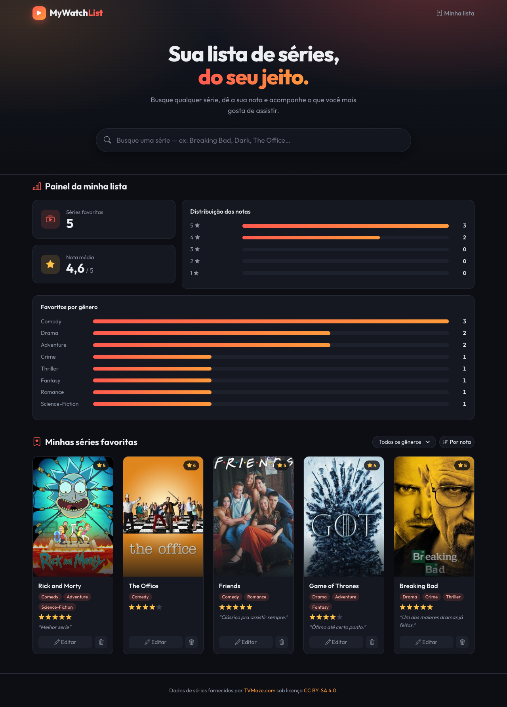
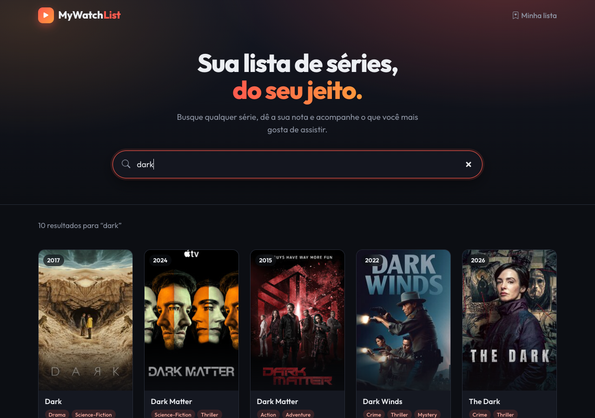

# 🎬 MyWatchList — Front-End

> Seu organizador pessoal de séries: busque qualquer série do mundo, dê a sua nota, comente e acompanhe sua lista num painel.

MyWatchList resolve um problema simples e comum: **"qual era mesmo aquela série que eu queria lembrar que gostei?"**. Em vez de listas soltas em notas do celular, você busca a série em tempo real (dados da [TVMaze](https://www.tvmaze.com)), salva nos favoritos com uma nota de 1 a 5 e um comentário, e organiza tudo por nota ou gênero, com um painel de estatísticas da sua lista.

Este repositório é o **componente principal** (interface) do MVP da Sprint 4 da Pós-Graduação em Engenharia de Software da PUC-Rio. Ele conversa com dois outros componentes:

| Componente | Papel | Repositório |
|---|---|---|
| **mywatchlist-front** (este) | Interface do usuário | https://github.com/AldySouza/mvp-sprint-4-mywatchlist-front |
| **mywatchlist-api** | API REST própria + banco SQLite | https://github.com/AldySouza/mvp-sprint-4-mywatchlist-api |
| **TVMaze API** | API externa pública (busca de séries) | https://www.tvmaze.com/api |



<details>
<summary>📸 Busca de séries (TVMaze)</summary>


</details>

---

## Sumário

- [Funcionalidades](#-funcionalidades)
- [Arquitetura](#-arquitetura)
- [API externa: TVMaze](#-api-externa-tvmaze)
- [Como rodar](#-como-rodar)
- [Estrutura de pastas](#-estrutura-de-pastas)
- [Tecnologias](#-tecnologias)

---

## ✨ Funcionalidades

- 🔎 **Busca em tempo real** de séries pela TVMaze, com *debounce* de 300 ms (uma requisição por pausa de digitação, não por tecla).
- ⭐ **Adicionar aos favoritos** com nota (1–5) e comentário opcional, em um modal.
- 📋 **Listar favoritos**: os mais recentes aparecem primeiro. Dá para **ordenar por nota** e **filtrar por gênero**, e séries com vários gêneros entram em todos os filtros correspondentes.
- ✏️ **Editar** nota e comentário (apagar o comentário também funciona).
- 🗑️ **Remover** com modal de confirmação.
- 📊 **Painel da lista**: total de séries, nota média, distribuição das notas e favoritos por gênero, em gráficos de barras com o valor sempre visível.
- 🎨 **Visual de app de streaming**: tema escuro, capas em formato de pôster com selo de nota e ano, animações ao passar o mouse e *skeleton* durante a busca.
- 🔔 **Feedback visual** com *toasts* de sucesso e erro em toda ação, mensagens claras quando a TVMaze ou a API estão fora do ar, e imagem de *placeholder* para séries sem capa.
- 📱 **Responsivo**: grid Bootstrap de 1 a 3 colunas.

### Onde cada componente é chamado

| Ação na tela | Chamada | Componente |
|---|---|---|
| Digitar no campo de busca | `GET https://api.tvmaze.com/search/shows?q=…` | TVMaze (externa) |
| Abrir a página / ordenar / filtrar | `GET /favoritos?sort_by=rating&genre=…` | mywatchlist-api |
| Abrir a página / após qualquer alteração | `GET /favoritos/estatisticas` | mywatchlist-api |
| Salvar no modal "Adicionar aos favoritos" | `POST /favoritos` | mywatchlist-api |
| Salvar no modal "Editar favorito" | `PUT /favoritos/{id}` | mywatchlist-api |
| Confirmar no modal "Remover favorito" | `DELETE /favoritos/{id}` | mywatchlist-api |

> Dica para ver tudo acontecendo: abra o DevTools do navegador (F12) → aba **Network**.

---

## 🏗️ Arquitetura

O projeto segue o **Cenário 1** do edital: interface que consome uma API externa e uma API própria com persistência.


<sub>🟧 módulos implementados neste MVP · 🟦 módulo externo consumido. A fonte do diagrama (Mermaid) está em [`docs/arquitetura.mmd`](docs/arquitetura.mmd).</sub>

**Estratégia de comunicação:**

1. O **Nginx** (container `mywatchlist-front`) só serve os arquivos estáticos (HTML, CSS, JS).
2. O JavaScript roda **no navegador** e chama a **TVMaze** direto para buscar séries. Os dados vêm em JSON e são tratados e exibidos dentro da própria aplicação, sem redirecionar o usuário.
3. O mesmo JavaScript chama a **mywatchlist-api** via REST (JSON) para salvar, listar, editar, remover e obter estatísticas. A API persiste os dados em **SQLite**, num volume Docker (`mywatchlist-data`), então os favoritos continuam lá depois de reiniciar os containers.

Por isso o front aponta para `http://localhost:8000` (constante `API_BASE_URL` em [`app.js`](app.js)): quem faz a chamada é o navegador, não o container.

---

## 🌐 API externa: TVMaze

| | |
|---|---|
| **O que é** | Base aberta de séries de TV: nomes, gêneros, capas, elenco etc. |
| **Documentação** | https://www.tvmaze.com/api |
| **Rota utilizada** | `GET https://api.tvmaze.com/search/shows?q={busca}`: busca séries por nome |
| **Cadastro / chave** | Não precisa. API pública, gratuita e sem autenticação. |
| **Licença** | Os dados são licenciados sob [CC BY-SA 4.0](https://creativecommons.org/licenses/by-sa/4.0/) e exigem atribuição, feita no rodapé da aplicação ("Dados de séries fornecidos por TVMaze.com"). |
| **Limite de uso** | A TVMaze garante no mínimo 20 requisições a cada 10 segundos por IP. O *debounce* de 300 ms mantém o uso bem abaixo disso. |
| **Campos consumidos** | `show.id`, `show.name`, `show.genres`, `show.image.medium` / `show.image.original` |

**Tratamento de falhas:** se a TVMaze estiver fora do ar ou a busca não trouxer nada, a interface mostra "Busca indisponível no momento" ou "Nenhum resultado encontrado". O resto da aplicação (favoritos e painel) continua funcionando.

Exemplo de resposta (resumida):

```json
[
  {
    "score": 0.9,
    "show": {
      "id": 169,
      "name": "Breaking Bad",
      "genres": ["Drama", "Crime", "Thriller"],
      "image": { "medium": "https://static.tvmaze.com/.../1253519.jpg" }
    }
  }
]
```

---

## 🚀 Como rodar

### Pré-requisitos

- [Docker](https://docs.docker.com/get-docker/) com Docker Compose (já vem no Docker Desktop)
- [Git](https://git-scm.com/)
- Portas **3001** e **8000** livres

### 1. Clone os dois repositórios lado a lado

O `docker-compose.yml` deste repositório builda a API a partir de `../mywatchlist-api`, então os dois precisam estar no mesmo diretório pai **e com esses nomes de pasta** (por isso o nome no final de cada `git clone`):

```bash
mkdir mywatchlist && cd mywatchlist
git clone https://github.com/AldySouza/mvp-sprint-4-mywatchlist-front.git mywatchlist-front
git clone https://github.com/AldySouza/mvp-sprint-4-mywatchlist-api.git mywatchlist-api
```

```
mywatchlist/
├── mywatchlist-front/   ← este repositório (com o docker-compose.yml)
└── mywatchlist-api/
```

### 2. Suba tudo com um comando

```bash
cd mywatchlist-front
docker compose up --build
```

Ou use o script, que também verifica se o Docker está instalado e tenta iniciá-lo se estiver parado:

| Sistema | Comando |
|---|---|
| macOS / Linux | `./start.sh` |
| Windows (CMD) | `start.bat` |
| Windows (PowerShell) | `.\start.ps1` |

### 3. Acesse

| O quê | URL |
|---|---|
| 🎬 Aplicação | http://localhost:3001 |
| 📘 Swagger da API | http://localhost:8000/docs |

Na primeira execução a API já cria 5 séries de exemplo, para a lista e o painel não começarem vazios.

**Para parar:** `Ctrl+C`, ou `docker compose down`. Os favoritos ficam salvos no volume; para apagá-los também, use `docker compose down -v`.

### Alternativa: sem Docker

O front é HTML/CSS/JS puro, sem *build*: basta um servidor estático. Suba primeiro a API (veja o [README da mywatchlist-api](https://github.com/AldySouza/mvp-sprint-4-mywatchlist-api#readme)) e depois:

```bash
./run.sh            # porta 3001 (padrão)
./run.sh 8080       # ou outra porta
# equivalente a: python3 -m http.server 8080
```

---

## 📁 Estrutura de pastas

```
mywatchlist-front/
├── index.html           # Estrutura da página: busca, painel, lista e modais
├── style.css            # Estilos próprios (cards, painel, gráficos de barras)
├── app.js               # Lógica: chamadas à TVMaze e à API, renderização, eventos
├── Dockerfile           # Imagem Nginx que serve os arquivos estáticos
├── docker-compose.yml   # Sobe front + API juntos (com volume do banco)
├── start.sh / .bat / .ps1   # Atalhos de inicialização com checagem do Docker
├── run.sh               # Execução sem Docker (servidor estático)
└── docs/
    ├── arquitetura.png  # Diagrama de arquitetura
    ├── arquitetura.mmd  # Fonte do diagrama (Mermaid)
    ├── tela-inicial.png # Captura da tela inicial
    └── busca.png        # Captura da busca
```

---

## 🛠️ Tecnologias

- **HTML5, CSS3, JavaScript (ES6+)**, sem framework e sem etapa de *build*
- **[Bootstrap 5.3](https://getbootstrap.com/)** via CDN: layout, modais e *toasts* (tema escuro customizado)
- **[Bootstrap Icons](https://icons.getbootstrap.com/)** e fonte **[Outfit](https://fonts.google.com/specimen/Outfit)** (Google Fonts)
- **[Nginx](https://nginx.org/)** (Alpine) para servir a aplicação em container
- **Docker / Docker Compose** para a orquestração

---

<sub>MVP da Sprint 4 (Arquitetura de Software), Pós-Graduação em Engenharia de Software, PUC-Rio.</sub>
